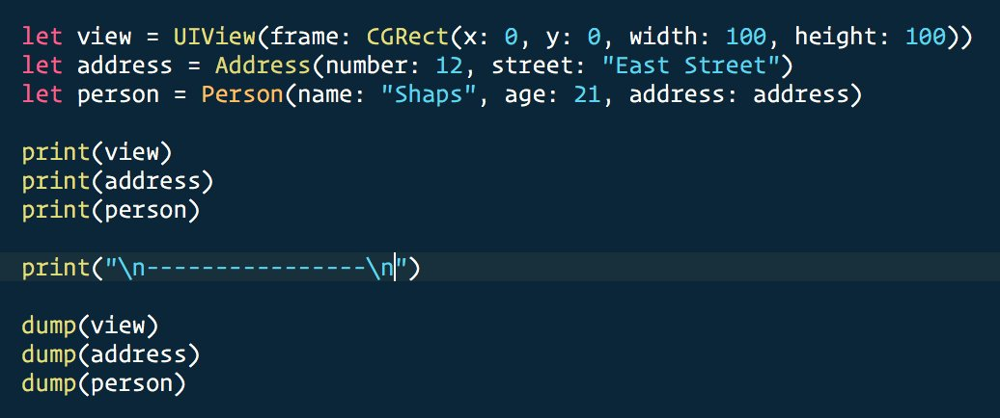
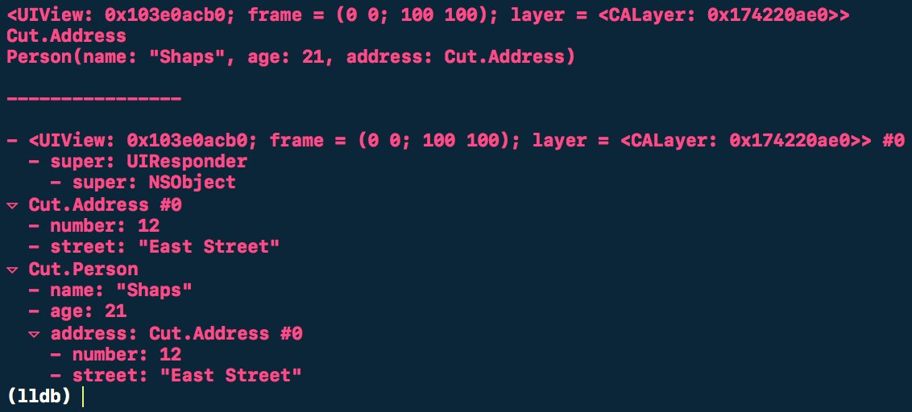

1) Why debug with `print` when you can `dump`?

`dump` uses Mirror for introspection.




Source: https://twitter.com/shaps/status/785786934375448576

2) Command to check if your app uses Advertising Identifier:
```fgrep -R advertisingIdentifier .```
