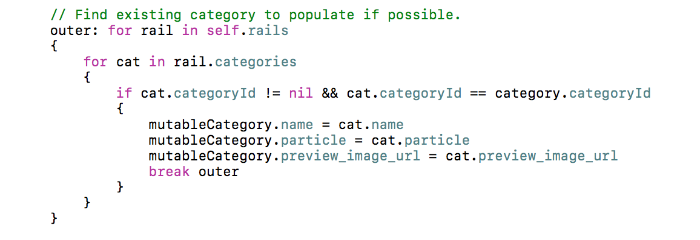

1) Why debug with `print` when you can `dump`?

`dump` uses Mirror for introspection.

Source: https://twitter.com/shaps/status/785786934375448576

2) Command to check if your app uses Advertising Identifier:

``fgrep -R advertisingIdentifier .``

3) Files in Documents folder.

Files placed in the Documents folder are automatically backed up to iCloud.
The backup process may not start instantly which is why you do not see your app's iCloud storage.
Use this code to exclude a file from the auto backup.

``try! filePath.setResourceValue(true, forKey: NSURLIsExcludedFromBackupKey)``

Source: https://developer.apple.com/library/ios/documentation/FileManagement/Conceptual/FileSystemProgrammingGuide/FileSystemOverview/FileSystemOverview.html

4) Example about strong and weak variables:

Imagine our object is a dog, and that the dog wants to run away (be deallocated).

Strong pointers are like a leash on the dog. As long as you have the leash attached to the dog, the dog will not run away. If five people attach their leash to one dog, (five strong pointers to one object), then the dog will not run away until all five leashes are detached.

Weak pointers, on the other hand, are like little kids pointing at the dog and saying "Look! A dog!" As long as the dog is still on the leash, the little kids can still see the dog, and they'll still point to it. As soon as all the leashes are detached, though, the dog runs away no matter how many little kids are pointing to it.

As soon as the last strong pointer (leash) no longer points to an object, the object will be deallocated, and all weak pointers will be zeroed out.

5) Example about atomic and nonatomic

Suppose there is an atomic string property called "name", and if you call [self setName:@"A"] from thread A, call [self setName:@"B"] from thread B, and call [self name] from thread C, then all operation on different thread will be performed *serially* which means if one thread is executing setter or getter, then other threads will wait. This makes property "name" read/write safe but if another thread D calls [name release] simultaneously then this operation might produce a crash because there is no setter/getter call involved here. Which means an object is read/write safe (ATOMIC) but not thread safe as another threads can simultaneously send any type of messages to the object. Developer should ensure thread safety for such objects.

If the property "name" was nonatomic, then all threads in above example - A,B, C and D will execute simultaneously producing any unpredictable result. In case of atomic, Either one of A, B or C will execute first but D can still execute in *parallel*.

6) ``layoutIfNeeded`` before animating constraints changes:

When animating constraint changes, Apple recommends to run layoutIfNeeded before the constraint changes, so if something stills needs to be animated, that will clean it.

Source: https://developer.apple.com/library/watchos/documentation/UserExperience/Conceptual/AutolayoutPG/AutoLayoutbyExample/AutoLayoutbyExample.html#//apple_ref/doc/uid/TP40010853-CH5-SW15

7) Auto-generate doc comment:

In Xcode 8, place the cursor above a method or function & press "⌥ + ⌘ + /" to auto-generate a doc comment.

8) Naming loops:

In Swift you can name loops so when you want to break one you can specify it by name.

Source: https://files.slack.com/files-pri/T036BGQE6-F2CRTPJU8/slack_for_ios_upload.jpg

