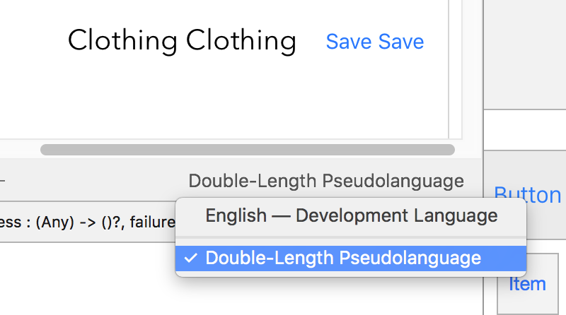

# Swift and Xcode tips

List of curiosities and utilities you might not now about Swift and Xcode.

## Why debug with `print` when you can `dump`?

`dump` uses Mirror for introspection. It's really useful in order to show the tree of properties with their values. It makes my day every time I print mapped objects from a JSON file.


Source: https://twitter.com/shaps/status/785786934375448576

## Command to check if your app uses Advertising Identifier:

``fgrep -R advertisingIdentifier .``

## Files in Documents folder.

Files placed in the Documents folder are automatically backed up to iCloud.
The backup process may not start instantly which is why you don't see your app's iCloud storage.
Use this code to exclude a file from the auto backup:

``try! filePath.setResourceValue(true, forKey: NSURLIsExcludedFromBackupKey)``

Source: https://developer.apple.com/library/ios/documentation/FileManagement/Conceptual/FileSystemProgrammingGuide/FileSystemOverview/FileSystemOverview.html

## Example about `strong` and `weak` properties:

Imagine our object is a dog, and that the dog wants to run away (be deallocated).

Strong pointers are like a leash on the dog. As long as you have the leash attached to the dog, the dog will not run away. If five people attach their leash to one dog, (five strong pointers to one object), then the dog will not run away until all five leashes are detached.

Weak pointers, on the other hand, are like little kids pointing at the dog and saying "Look! A dog!" As long as the dog is still on the leash, the little kids can still see the dog, and they'll still point to it. As soon as all the leashes are detached, though, the dog runs away no matter how many little kids are pointing to it.

As soon as the last strong pointer (leash) no longer points to an object, the object will be deallocated, and all weak pointers will be zeroed out.

## Example about atomic and nonatomic

Suppose there is an atomic string property called "name", and if you call [self setName:@"A"] from thread A, call [self setName:@"B"] from thread B, and call [self name] from thread C, then all operation on different thread will be performed *serially* which means if one thread is executing setter or getter, then other threads will wait. This makes property "name" read/write safe but if another thread D calls [name release] simultaneously then this operation might produce a crash because there is no setter/getter call involved here. Which means an object is read/write safe (ATOMIC) but not thread safe as another threads can simultaneously send any type of messages to the object. Developer should ensure thread safety for such objects.

If the property "name" was nonatomic, then all threads in above example - A,B, C and D will execute simultaneously producing any unpredictable result. In case of atomic, Either one of A, B or C will execute first but D can still execute in *parallel*.

## ``layoutIfNeeded`` before animating constraints changes:

When animating constraint changes, Apple recommends to run layoutIfNeeded before the constraint changes, so if something stills needs to be animated, that will clean it.

Source: https://developer.apple.com/library/watchos/documentation/UserExperience/Conceptual/AutolayoutPG/AutoLayoutbyExample/AutoLayoutbyExample.html#//apple_ref/doc/uid/TP40010853-CH5-SW15

## Auto-generate doc comment:

In Xcode 8, place the cursor above a method or function & press "⌥ + ⌘ + /" to auto-generate a doc comment.

## Naming loops:

In Swift you can name loops so when you want to break one you can specify it by name.


Source: https://files.slack.com/files-pri/T036BGQE6-F2CRTPJU8/slack_for_ios_upload.jpg

## Int over UInt:

Use UInt only when you specifically need an unsigned integer type with the same size as the platform’s native word size. If this is not the case, Int is preferred, even when the values to be stored are known to be non-negative. A consistent use of Int for integer values aids code interoperability, avoids the need to convert between different number types, and matches integer type inference, as described in Type Safety and Type Inference.

Source: https://developer.apple.com/library/content/documentation/Swift/Conceptual/Swift_Programming_Language/TheBasics.html#//apple_ref/doc/uid/TP40014097-CH5-XID_411

## Outlet Collection

Did you know you can create an array of NSLayoutConstraints as part of the same property? This is called outlet collection and it's really useful in terms of deactivating/activating and removing/adding constraints at the same time with just one line of code. Also, in case you want to access to a specific constraint of that array, you can do it by accessing the element through the tag. For example:

```swift
@IBOutlet var widthConstraints: [NSLayoutConstraint]!

@IBAction func imageTapped(sender: UITapGestureRecognizer) {
    guard let tag = sender.view?.tag else { return }
    
    let widthConstraint = widthConstraints[tag]
    print("The constraint: \(widthConstraint) represents the width for the outlet referenced by the tag \(tag)")
}
```

## Leading/Trailing vs Left/Right

Have you ever wondered what's the difference between Leading and Left? There's a good reason to differenciate them and it's the language reading direction. Right now you are reading this text from left to right, but for example arabic language is read from right to left. Xcode automatically does the hard work for you from the preferences, but you still need to pin the outlets to the leading and trailing edges when you need that element to mirror. Keep in mind that for those RTL (Right to Left) languages, leading and trailing will switch, so everything you pinned to the leading will follow that rule. However, left and right edges are universal and won't change, so just pin the outlets to the left and right if you are sure you don't want that outlet to mirror.


## Avoid NSObject and @objc to Improve Performance

Swift allows us to extend classes from NSObject to get Objective-C runtime features for an object. It also allows us to annotate Swift methods with @objc to allow the methods to be used by the Objective-C runtime.

Supporting the Objective-C runtime means that method calls are going to be using dynamic dispatch instead of static or vtable dispatch. This end result is that methods that support the Objective-C runtime have a four times performance penalty when called. In practical usage, the performance hit may be negligible but the cool thing is that armed with this knowledge, we now know that method execution in Swift is four times faster than Objective-C.

Source: https://savvyapps.com/blog/swift-tips-for-developers

## Double-Length Pseudolanguage

The preview assistant editor is important in order how see how things will look in different configurations but also in different languages. If you have localizations already added to the storyboard and/or nib file, you can open the preview from the editor mode and they will show up in the bottom right corner. Here you will find a handy language called double-length Pseudolanguage, which will double every string you have in the interface builder and show you how the layout will respond to longer strings.



Source: https://videos.raywenderlich.com/courses/auto-layout/lessons/5

## translatesAutoresizingMaskIntoConstraints

This property must be set to false if you create your own constraints by code. If you forget it, you will get errors in the debug console that your constraints are conflicting with the ones created by translates autoresizing mask into constraints.

## Vocabulary for Unit Testing

Test Double is a generic term for any case where you replace a production object for testing purposes. There are various kinds of double:
- Dummy objects are passed around but never actually used. Usually they are just used to fill parameter lists.
- Fake objects actually have working implementations, but usually take some shortcut which makes them not suitable for production (an InMemoryTestDatabase is a good example).
- Stubs provide canned answers to calls made during the test, usually not responding at all to anything outside what's programmed in for the test.
- Spies are stubs that also record some information based on how they were called. One form of this might be an email service that records how many messages it was sent.
- Mocks are pre-programmed with expectations which form a specification of the calls they are expected to receive. They can throw an exception if they receive a call they don't expect and are checked during verification to ensure they got all the calls they were expecting.

Source: http://www.martinfowler.com/bliki/TestDouble.html
